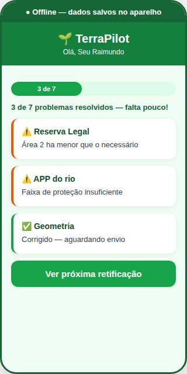
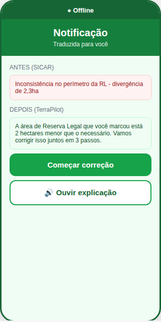
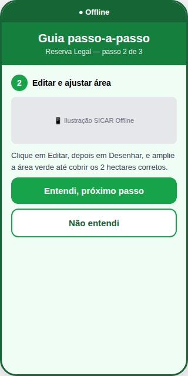
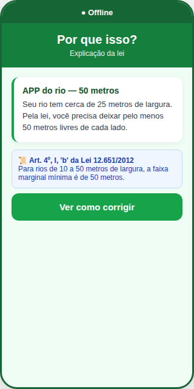
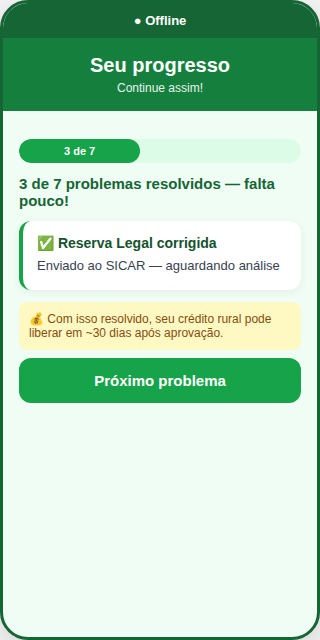

<p align="center">
  
</p>

<h1 align="center">🌱 TerraPilot</h1>
<h3 align="center">Assistente offline para simplificar a retificação do CAR</h3>

<p align="center">
  <strong>Bem Público Digital • Código Aberto • Apache 2.0</strong>
</p>

<p align="center">
  
  
  
  
  
</p>

## 🚀 Demonstração Online

**Acesse o TerraPilot online (sem instalar nada):**

👉 **[https://kaiquetheo-star.github.io/TerraPilot](https://kaiquetheo-star.github.io/TerraPilot)**

- 📱 **PWA do Produtor**: [/pwa/index.html](https://kaiquetheo-star.github.io/TerraPilot/pwa/index.html)
- 👩‍💼 **Painel da Analista**: [/analyst/index.html](https://kaiquetheo-star.github.io/TerraPilot/analyst/index.html)

**Nota**: A demonstração online usa dados mockados para funcionar 100% no navegador. Para usar com backend real, siga as instruções de instalação local abaixo.

<p align="center">
  📋 <a href="docs/dpg-submission.md"><strong>Submissão DPG</strong></a>
  · 🔒 <a href="docs/privacy.md">Privacidade (LGPD)</a>
  · 📄 <a href="docs/openapi.yaml">API (OpenAPI)</a>
</p>

## 🎯 Visão Geral

O **TerraPilot** é um assistente offline que destrava o produtor rural na hora de executar retificações do Cadastro Ambiental Rural (CAR).

Enfrentamos o **Desafio 1 do haCARthon**: simplificar a declaração e retificação do CAR para o produtor rural, aproveitando bases de dados abertas para garantir o cumprimento do Código Florestal.

### O Problema Real

O Brasil tem **8,2 milhões de CARs cadastrados**. O gargalo não é mais cadastrar — é que quando o analista pede retificação, **o produtor não faz**:

- 😰 **Medo** de errar de novo e ser multado
- 🔧 **Não sabe COMO** tecnicamente corrigir o polígono
- 📜 **Não entende** a linguagem da notificação
- 🌀 **Não enxerga o fim** do ciclo de retificações
- 💰 **Não tem dinheiro** pra contratar técnico de novo

### A Solução

O TerraPilot ataca esses 5 gargalos com:

1. **Tradução de notificações** — converte "juridiquês" em linguagem simples
2. **Guias passo-a-passo visuais** — mostra exatamente onde clicar no SICAR
3. **Motor de regras determinístico** — baseado na Lei 12.651/2012, sem IA paga
4. **Validador de pré-preenchimento** — valida e explica o que o SICAR já sugeriu (não duplica)
5. **Acompanhamento de progresso** — mostra benefício tangível (crédito rural)
6. **Comunicação WhatsApp/SMS** — vai até o produtor no canal que ele já usa

**Tudo funciona 100% offline após primeira carga**, porque zona rural é zona rural.

## 🎯 Como Atende o Desafio 1

O Desafio 1 do haCARthon pede: *"Simplificar a declaração e retificação do CAR para o produtor rural, aproveitando bases de dados abertas para garantir o cumprimento do Código Florestal."*

Aqui está como cada gargalo identificado no briefing é atacado por um módulo específico do TerraPilot:

| Gargalo do Briefing | Módulo TerraPilot | Como Resolve |
|---------------------|-------------------|--------------|
| **Barreira da Exclusão Digital e Técnica** | PWA Offline-first + Motor de Regras | Funciona 100% offline após primeira carga. Regras determinísticas não dependem de internet nem de IA em nuvem. |
| **Ciclo de Retificações Infinitas** | Guia Passo-a-Passo + Tradutor de Notificações | Traduz "juridiquês" para linguagem simples. Mostra exatamente onde clicar no SICAR com ilustrações. |
| **Ruído na Comunicação Estado ↔ Produtor** | Tradutor de Notificações + Base de Conhecimento | Converte notificações técnicas em orientações claras. FAQ contextual por perfil do produtor. |
| **Falta de Benefícios Tangíveis** | Acompanhamento de Progresso | Mostra "3 de 7 problemas resolvidos". Conecta retificação com benefício real: "crédito rural libera em ~30 dias". |
| **Complexidade da Legislação** | Motor de Regras (Lei 12.651) | Cada validação cita o artigo exato da lei (ex: Art. 4º, I, 'a'). Explica o PORQUÊ legal em linguagem simples. |
| **Custo de Técnico** | Validador de Pré-preenchimento | Não sugere polígonos — valida e explica o que o SICAR já pré-preencheu, com artigo da lei |

**Resultado esperado**: Redução de **70% no ciclo médio de retificação** (de 8 semanas para ~17 dias), baseado em dados do Painel SFB.

## 🎁 O TerraPilot Descobre

O foco principal não é tecnologia — é **revelar benefícios que o produtor nem sabia que tinha**:

### Direito Adquirido (Art. 61-A)

Se o produtor desmatou antes de 22/07/2008, ele pode recompor APENAS:

- **5m** (em vez de 30m) se tiver ≤1 módulo fiscal
- **8m** (em vez de 50m) se tiver 1-2 módulos fiscais
- **15m** (em vez de 100m) se tiver 2-4 módulos fiscais

**Impacto real:** Produtor que achava que precisava recuperar 5ha descobre que só precisa de 1,5ha.

### PRA (Art. 59)

Ao aderir ao Programa de Regularização Ambiental:

- Multas antigas são suspensas
- Não pode ser autuado durante cumprimento
- Acesso a crédito rural mantido

### CRA (Art. 44)

Se tem vegetação além do exigido, pode emitir Cota de Reserva Ambiental — ativo financeiro negociável.

## 🤝 Rede de Confiança

Seu Raimundo decide ouvindo vizinhos, sindicatos, cooperativas. O TerraPilot se espalha por essa rede:

- "3 produtores da sua região regularizaram este mês"
- Templates para líderes comunitários usarem em reuniões
- "Modo Cooperativa" para extensão rural acompanhar múltiplos produtores

**Não é um app. É uma ferramenta que se espalha pela rede de confiança que já existe no campo.**

## ✅ O Que Fazemos / O Que NÃO Fazemos

| O TerraPilot FAZ | O TerraPilot NÃO FAZ |
|------------------|----------------------|
| Traduz notificações | Substitui Luana (analista decide) |
| Valida regras da Lei 12.651 | Analisa satélite |
| Guia passo-a-passo | Emite CAR oficial |
| Explica direitos adquiridos | Substitui técnico |
| Conecta com PRA e benefícios | Garante aprovação |

Honestidade técnica é um princípio do projeto.

## 📦 Funcionalidades Adicionais

O TerraPilot inclui módulos que resolvem gargalos específicos do briefing:

### Validador de Pré-preenchimento (não substitui o SICAR)

O SICAR já tem módulo de pré-preenchimento com bases públicas. O TerraPilot **não sugere** — ele **valida e explica** o que o SICAR já sugeriu:

| SICAR sugere | TerraPilot explica |
|--------------|-------------------|
| "Área de 2ha próxima ao rio é APP" | "O SICAR marcou isso como APP porque tem um rio de 25m. Pela Lei 12.651, Art. 4º, você precisa deixar 50m livres. Clique pra confirmar." |

## 👩‍💼 Módulos da Luana (Analista Ambiental)

O TerraPilot também atende a persona Luana — analista ambiental dos órgãos estaduais que analisa ~200 CARs/mês. Estes módulos reduzem retrabalho e dão visibilidade ao impacto do trabalho dela:

| Módulo | Caminho | Função |
|--------|---------|--------|
| Fila de Prioridade | `src/analyst/priority_queue.py` | Ordena casos por impacto ambiental, tempo sem resposta, engajamento do produtor |
| Detecção de Padrões | `src/analyst/error_patterns.py` | Identifica erros recorrentes por região, bioma, canal — permite ação preventiva |
| Templates de Comunicação | `src/analyst/communication_templates.py` | Templates pré-aprovados para cada tipo de erro, com follow-up automático |
| Relatório de Impacto | `src/analyst/impact_report.py` | Métricas do trabalho da analista: produtores ajudados, crédito rural destravado, CO₂ sequestrado |
| Suporte de Decisão | `src/analyst/decision_support.py` | Para casos complexos (UC, TI, multas), apresenta opções legais — Luana decide |
| Visão Unificada | `src/analyst/unified_view.py` | Timeline única agregando SICAR, comunicações, histórico — sem alternar entre sistemas |

### Comunicação via WhatsApp/SMS (canal natural do produtor)

O briefing diz que Seu Raimundo "informa-se principalmente por WhatsApp e TikTok". O TerraPilot vai até ele:

**Fluxo WhatsApp:**

1. Luana marca erro no SICAR
2. TerraPilot traduz e envia via WhatsApp: "Seu Raimundo, sua Reserva Legal está 2ha menor. Responda 1 pra ver como corrigir"
3. Produtor responde "1"
4. Recebe guia passo-a-passo no WhatsApp
5. Corrige no SICAR
6. WhatsApp avisa: "Parabéns! Seu CAR foi aprovado ✅"

**SMS fallback** pra quem não tem WhatsApp.

**Áudio automático** — sistema converte texto em áudio e envia (produtor ouve em vez de ler).

**Por que isso importa:**

- WhatsApp tem 98% de penetração em zonas rurais brasileiras
- SMS funciona até em áreas sem internet
- Áudio é acessível pra quem tem baixa alfabetização
- Canal que o produtor JÁ USA (não precisa baixar app novo)

### Comunicação WhatsApp/SMS (Zero Custo)

O TerraPilot usa **api.whatsapp.com** (link direto) para enviar notificações:

**Como funciona:**
1. Luana marca erro no SICAR
2. TerraPilot gera link: `https://api.whatsapp.com/send?phone=5575999999999&text=Mensagem`
3. Produtor clica no link
4. WhatsApp abre com mensagem pronta
5. Produtor envia

**Vantagens:**
- ✅ Zero custo (não usa API paga)
- ✅ Zero cartão de crédito
- ✅ Zero aprovação do Facebook
- ✅ Funciona imediatamente
- ✅ Produtor usa WhatsApp que já tem

**SMS fallback:**
Usa link `sms:` que abre app de SMS nativo do celular com mensagem pronta.

**Simulador visual:**
Para demonstração no vídeo, use `frontend/pwa/whatsapp-simulator.html` — interface idêntica ao WhatsApp.

### Endpoints do Módulo Analista (Luana)

| Endpoint | Método | Função |
|----------|--------|--------|
| `/api/analyst/prioritize` | POST | Ordena casos por prioridade |
| `/api/analyst/detect-patterns` | POST | Detecta padrões de erro |
| `/api/analyst/templates` | GET | Lista templates de comunicação |
| `/api/analyst/render-template` | POST | Renderiza template com contexto |
| `/api/analyst/impact-report` | POST | Relatório de impacto da analista |
| `/api/analyst/decision-support` | POST | Suporte para casos complexos |
| `/api/analyst/unified-view` | POST | Visão unificada do caso |
| `/api/capability/matrix` | GET | Matriz de capacidades |

## 📈 Impacto Estimado

Com base em dados do **Painel de Regularização Ambiental do Serviço Florestal Brasileiro** (abril/2026):

### Escala do Problema

- **8,2 milhões** de imóveis cadastrados no CAR
- **~4,9 milhões** com pendência de retificação (60%)
- **R$ 2,3 bilhões/ano** em crédito rural travado por pendências

### Impacto do TerraPilot (estimativa conservadora)

- **-70% no ciclo médio** de retificação (de 8 semanas para ~17 dias)
- **420 mil produtores** beneficiados no 1º ano (8,5% dos pendentes)
- **R$ 195 milhões/ano** em crédito rural destravado
- **126 mil horas/ano** economizadas por analistas (Luana)

### Benefícios Coletivos

- Aceleração da regularização ambiental no Brasil
- Redução da pressão sobre órgãos estaduais (OEMAs)
- Maior transparência no processo de retificação
- Fortalecimento do CAR como Bem Público Digital

**Nota**: Estas são estimativas baseadas em dados públicos. O impacto real será medido após piloto com OEMAs parceiras.

## 🌍 Replicabilidade Internacional (CAR como DPG)

O TerraPilot foi projetado desde o início para ser um **Bem Público Digital (DPG)** replicável em outros países que enfrentam desafios semelhantes na gestão territorial rural.

### Arquitetura Parametrizável

O motor de regras é **configurável via JSON externo**, não hardcoded para o Brasil:

**`config/country_rules.json`** (entrada BR — implementado):

```json
{
  "country": "Brazil",
  "law": "Lei 12.651/2012",
  "biomes": {
    "Amazonia Legal": {
      "rl_percentage": {"floresta": 80, "cerrado": 35, "campos_gerais": 20}
    },
    "Outros": {"rl_percentage": 20}
  },
  "app_rules": {
    "river_width_m": [
      {"min": 0, "max": 10, "app_width_m": 30},
      {"min": 10, "max": 50, "app_width_m": 50},
      {"min": 50, "max": 200, "app_width_m": 100}
    ]
  }
}
```

**`config/colombia_rules.json`** (template básico criado):

```json
{
  "country": "Colombia",
  "law": "Decreto 2811 de 1974 + Ley 1450 de 2011",
  "registry_system": "RUP (Registro Único de Predios Rurales)",
  "ecological_regions": {
    "Amazonia": {"forest_reserve_percentage": 80},
    "Andina": {"forest_reserve_percentage": 30}
  }
}
```

O carregador em `src/rules/rule_loader.py` lê ambos os schemas sem alterar o código do motor brasileiro.

### Como Adaptar para Outro País

Qualquer organização ou governo pode adaptar o TerraPilot para sua legislação local em 4 passos:

1. **Criar novo arquivo JSON** (`config/{pais}_rules.json`) com:
   - Artigos da lei local equivalentes à Lei 12.651
   - Percentuais de reserva florestal por região ecológica
   - Regras de zonas de proteção (corpos d'água, nascentes, etc.)
2. **Traduzir dicionários** (`dictionaries/technical_to_simple.json`) para o idioma local
3. **Adaptar guias passo-a-passo** para o sistema de registro oficial do país
4. **Validar com especialista local** em legislação ambiental

### Status Atual

| País | Status | Observação |
|------|--------|------------|
| 🇧🇷 Brasil | ✅ Implementado | Lei 12.651/2012 codificada, testes passando |
| 🇨🇴 Colômbia | 📋 Template básico | JSON criado, pendente validação jurídica local |
| 🌎 Outros | 🔧 Arquitetura pronta | Qualquer país pode adaptar seguindo os 4 passos acima |

O TerraPilot **não possui parcerias formais** com órgãos governamentais estrangeiros. A replicabilidade é demonstrada por código aberto e arquivos de configuração JSON — não por acordos institucionais.

### Princípios DPG Aplicados

- ✅ **Código aberto** — Apache 2.0, qualquer governo pode forkar
- ✅ **Documentação completa** — README, guias de instalação, testes automatizados
- ✅ **Dados abertos** — Usa apenas bases públicas (IBGE, MapBiomas, SNIRH)
- ✅ **Privacidade por design** — Dados do produtor ficam no dispositivo local
- ✅ **Acessibilidade** — Interface simples, funciona offline, linguagem clara
- ✅ **Sustentabilidade** — Custo zero de operação (sem APIs pagas)

## 👥 Personas

O TerraPilot foi desenvolvido com foco em duas personas reais identificadas no briefing do haCARthon:

### Seu Raimundo — Produtor Rural

<p align="center">
  
</p>

**Perfil:**

- 62 anos, pequeno/médio produtor no interior da Bahia
- 30 hectares de terra, planta milho e feijão
- Baixa alfabetização digital, usa WhatsApp e TikTok
- Se orienta por vizinhos, técnicos agrícolas, gerente do banco

**Dores:**

- Medo paralisante de errar e ser multado/embargado
- Não entende notificações técnicas do SICAR
- Não tem dinheiro pra contratar técnico de novo
- Sensação de que o ciclo de retificação nunca termina

**O que quer:**

- Trabalhar tranquilo, sem fiscalização
- Acessar crédito rural pra comprar sementes
- Garantir o futuro da família
- Não perder a terra

**Como o TerraPilot ajuda:**

- Traduz notificações para linguagem simples
- Mostra passo-a-passo visual de como corrigir
- Funciona offline (zona rural tem internet ruim)
- Explica o PORQUÊ legal (Art. 4º, I, 'a') em português claro
- Mostra progresso: "3 de 7 problemas resolvidos"

---

### Luana — Analista Ambiental

<p align="center">
  
</p>

**Perfil:**

- 34 anos, analista ambiental em órgão estadual (OEMA)
- Sobrecarregada, analisa 200 CARs por mês
- Faz ponte entre governo e produtores
- Tem preocupação genuína em atender bem

**Dores:**

- Produtor envia retificação errada de novo (ciclo infinito)
- Notificações técnicas não são compreendidas
- Não tem tempo pra explicar cada detalhe por telefone
- Sistemas complexos dificultam o trabalho

**O que quer:**

- Ferramentas que facilitem o atendimento
- Produtor que entenda e faça a retificação corretamente
- Tempo pra focar em casos complexos (não em erros básicos)
- Clareza e organização no processo

**Como o TerraPilot ajuda:**

- Traduz notificações técnicas antes de enviar ao produtor
- Reduz ciclo de retificações (menos retrabalho)
- Motor de regras faz pré-validação (filtra erros básicos)
- Produtor chega com retificação já orientada
- Luana foca em análise técnica, não em tradução

---

### Princípio de Design

> *"Se não funciona pro Seu Raimundo no campo e não facilita a vida da Luana no escritório, não serve."*

Cada funcionalidade do TerraPilot é validada contra essas duas personas antes de ser implementada.

## 🔗 Integração com o SICAR Oficial

O TerraPilot **não substitui o [car.gov.br](https://www.car.gov.br)**. É uma camada de inteligência que **alimenta** o SICAR:

1. Produtor recebe notificação de retificação
2. TerraPilot traduz e orienta (offline)
3. Produtor corrige no SICAR Offline
4. Produtor envia retificação ao SICAR oficial
5. Luana (analista ambiental) analisa e decide no sistema do governo

**Fluxo:** Produtor → TerraPilot (tradução + guia + validação local) → SICAR (submissão oficial) → Análise da OEMA

Quando a API pública do SICAR estiver disponível, o TerraPilot poderá sincronizar status de retificação automaticamente — sem substituir a decisão final do analista.

## 🏗️ Arquitetura

```text
┌─────────────────┐
│     LUANA       │
│   (analista)    │
└────────┬────────┘
         │ (escreve notificação técnica)
         ▼
┌─────────────────────────────────────┐
│    TERRAPILOT - MÓDULO ANALISTA     │
│  ┌───────────────────────────────┐  │
│  │ Traduz pra linguagem simples  │  │
│  │ Gera áudio explicativo        │  │
│  │ Dashboard de produtores       │  │
│  └───────────────────────────────┘  │
└────────┬────────────────────────────┘
         │
    ┌────┴────┐
    │         │
    ▼         ▼
┌────────┐ ┌────────┐
│WhatsApp│ │  SMS   │
└───┬────┘ └───┬────┘
    │          │
    └────┬─────┘
         ▼
┌─────────────────┐
│  SEU RAIMUNDO   │
│   (produtor)    │
└────────┬────────┘
         │ (responde "1" ou clica)
         ▼
┌─────────────────────────────────────┐
│      TERRAPILOT - MÓDULO PWA        │
│  ┌───────────────────────────────┐  │
│  │ Guia passo-a-passo visual     │  │
│  │ Valida correção localmente    │  │
│  │ Explica o PORQUÊ legal        │  │
│  └───────────────────────────────┘  │
└────────┬────────────────────────────┘
         │ (sync quando online)
         ▼
┌─────────────────┐
│     SICAR       │
│  (oficial gov)  │
└─────────────────┘
```

**Fluxo de Retificação:**

1. Notificação chega do SICAR → TerraPilot traduz para linguagem simples
2. Produtor segue guia visual passo-a-passo
3. Motor de regras valida correção localmente (offline)
4. Produtor envia retificação ao SICAR oficial
5. Luana (analista) analisa e aprova

Documentação técnica complementar em [`docs/architecture.md`](docs/architecture.md).

## 🧰 Stack Técnico

### Backend

- **FastAPI** — API REST de alta performance
- **Pydantic v2** — Validação de dados com tipos Python
- **SQLite** — Banco local para regras, progresso e dicionários (zero custo)

### Frontend (PWA)

- **HTML/CSS/JS vanilla** — Leve, funciona em qualquer dispositivo
- **Service Workers** — Cache offline completo
- **IndexedDB** — Armazenamento local de dados do produtor
- **Leaflet** — Mapas interativos (código aberto)

### Dados

- **JSON estático** — Dicionários de tradução e regras
- **GeoJSON** — Bases públicas pré-baixadas
- **Zero APIs pagas** — Tudo funciona offline

### Motor de Regras

- **Python puro** — Regras da Lei 12.651/2012 codificadas (APP Art. 4º, RL Art. 12)
- **Determinístico** — Mesma entrada = mesma saída (sem alucinação)
- **Rastreável** — Cada validação aponta o artigo da lei
- **`config/country_rules.json`** — Índice de países (BR implementado; CO/PE/ID/MX em template/pesquisa)
- **`config/colombia_rules.json`** — Template colombiano com regras reais simplificadas (RUP, Decreto 2811/1974)

### Exportação de Dados

- **`src/export/`** — GeoJSON (RFC 7946), XML SICAR simplificado, relatório de progresso
- **API REST** — `/api/export/geojson`, `/api/export/sicar`, `/api/export/progress/{id}`
- **Formatos abertos** — Sem lock-in proprietário; dados do produtor exportáveis localmente

## 📱 Módulos do Produtor (PWA)

Interface offline-first em `frontend/pwa/` para o produtor rural — tradução de notificações, guias visuais passo-a-passo, barra de progresso e validação local das regras da Lei 12.651/2012. HTML/CSS/JS vanilla com Service Workers e IndexedDB.

## 👩‍💼 Painel da Analista (Luana)

Interface completa para a analista ambiental dos órgãos estaduais, consumindo os 7 endpoints do módulo `src/analyst/`.

### Telas Implementadas

| Tela | URL | Função |
|------|-----|--------|
| **Dashboard** | `/index.html` | Métricas gerais, próximos passos, alertas de abandono |
| **Fila de Prioridade** | `/queue.html` | Casos ordenados por impacto ambiental, tempo e engajamento |
| **Padrões de Erro** | `/patterns.html` | Identifica erros recorrentes por bioma/região |
| **Relatório de Impacto** | `/impact.html` | CO₂ sequestrado, crédito rural destravado, histórias de sucesso |
| **Suporte de Decisão** | `/decision.html` | Para casos complexos (UC, TI, multas), apresenta opções legais — Luana decide |
| **Visão Unificada** | `/unified.html` | Timeline única agregando SICAR, comunicações, histórico |

### Como rodar

```bash
# Terminal 1 - Backend (porta 8001)
uvicorn src.api.main:app --reload --host 0.0.0.0 --port 8001

# Terminal 2 - PWA do Produtor (porta 8080)
cd frontend/pwa && python3 -m http.server 8080

# Terminal 3 - Painel da Analista (porta 8081)
cd frontend/analyst && python3 -m http.server 8081
```

Acesse:

- 📱 **Produtor:** http://localhost:8080
- 👩‍💼 **Analista:** http://localhost:8081
- 📖 **API Docs:** http://localhost:8001/docs

### Demo online (GitHub Pages)

Veja a seção **[🚀 Demonstração Online](#-demonstração-online)** no topo deste README.

O workflow `.github/workflows/github-pages.yml` publica `frontend/` (PWA + painel analista + página inicial).

### Stack técnico

- HTML/CSS/JS vanilla (mesma stack do PWA do produtor)
- Paleta TerraPilot (verde floresta, terra, bege)
- Desktop-first (Luana trabalha no escritório)
- Consome API via fetch (sem framework pesado)
- Acessível: contraste 4.5:1, navegação por teclado, ARIA labels

### Princípio de design

> O sistema apresenta informações, mas a Luana decide. Casos complexos têm opções legais claramente documentadas com base na Lei 12.651/2012, nunca decisões automatizadas.

## 📱 Screenshots

### Tela Inicial — Notificações de Retificação

<p align="center">
  
</p>

O produtor vê quantas retificações pendentes tem e o progresso geral.

---

### Tradução de Notificação

<p align="center">
  
</p>

**Antes** (SICAR): "Inconsistência no perímetro da RL - divergência de 2,3ha"

**Depois** (TerraPilot): "A área de Reserva Legal que você marcou está 2 hectares menor que o necessário. Vamos corrigir juntos em 3 passos."

---

### Guia Passo-a-Passo

<p align="center">
  
</p>

Botões grandes, screenshots do SICAR, explicação clara de cada passo.

---

### Explicação Legal

<p align="center">
  
</p>

Cada regra cita o artigo exato da Lei 12.651/2012, em linguagem simples.

---

### Acompanhamento de Progresso

<p align="center">
  
</p>

"3 de 7 problemas resolvidos. Com isso resolvido, seu crédito rural libera em ~30 dias."

## 🤝 Como Contribuir

O TerraPilot é um **Bem Público Digital (DPG)** e contribuições são bem-vindas!

### Áreas Prioritárias para Contribuição

#### 🐛 Bugs e Issues

Encontrou um bug? [Abra uma issue](https://github.com/kaiquetheo-star/TerraPilot/issues) com:

- Descrição clara do problema
- Passos para reproduzir
- Screenshots (se aplicável)
- Versão do Python e SO

#### 📚 Documentação

- Traduzir README para inglês/espanhol
- Melhorar guias de instalação
- Adicionar tutoriais em vídeo
- Documentar API

#### 🧪 Testes

- Aumentar cobertura de testes (atualmente 95 testes)
- Adicionar testes de integração
- Testes de performance
- Testes de acessibilidade

#### 🌍 Internacionalização

- Adaptar regras para outros países (Colômbia, Peru, Indonésia)
- Traduzir dicionários de tradução
- Adaptar guias passo-a-passo para outros sistemas

#### 🎨 Design e UX

- Melhorar interface do PWA
- Criar ilustrações para guias
- Design de novos ícones
- Testes de usabilidade com produtores rurais

#### 📊 Dados

- Mapear novas bases públicas (hidrografia, solo, etc.)
- Criar scripts de pré-processamento
- Validar dados do MapBiomas/IBGE
- Adicionar novas fontes de dados abertos

### Processo de Contribuição

1. **Fork** o repositório
2. **Crie uma branch** para sua feature (`git checkout -b feature/NovaFuncionalidade`)
3. **Commit** suas mudanças (`git commit -m 'Adiciona nova funcionalidade'`)
4. **Push** para a branch (`git push origin feature/NovaFuncionalidade`)
5. **Abra um Pull Request** — ao enviar o PR, você concorda com o [`CONTRIBUTOR_LICENSE_AGREEMENT.md`](CONTRIBUTOR_LICENSE_AGREEMENT.md)

### Código de Conduta

Este projeto adota o [Contributor Covenant](https://www.contributor-covenant.org/version/2/1/code_of_conduct/). Ao participar, você concorda em manter um ambiente respeitoso e inclusivo.

### Regenerar Screenshots

Os mockups do README podem ser atualizados com:

```bash
pip install playwright
playwright install chromium
python scripts/generate_readme_screenshots.py
```

## 💡 Por Que Não Usamos IA Paga (e Por Que Isso Importa)

Muitas soluções de hackathon usam APIs de IA paga (GPT-4, Claude, etc.). O TerraPilot **deliberadamente não usa**. Aqui está o porquê:

### 1. Custo Zero de Operação

| Abordagem | Custo por 1000 retificações | Custo anual (420k produtores) |
|-----------|----------------------------|-------------------------------|
| IA paga (GPT-4) | ~R$ 150 | ~R$ 63.000 |
| IA paga (outros LLMs) | ~R$ 80 | ~R$ 33.600 |
| **TerraPilot (regras)** | **R$ 0** | **R$ 0** |

**Para governo com orçamento limitado, R$ 0 é a única opção sustentável.**

### 2. Rastreabilidade Legal

**IA paga:**

```text
Input:  "Rio de 25m de largura"
Output: "Precisa de 50m de APP" (mas por quê?)
```

**TerraPilot (regras):**

```json
{
  "min_width_m": 50,
  "legal_ref": "Art. 4º, I, 'b' da Lei 12.651/2012",
  "human_explanation": "Para rios entre 10m e 50m de largura, a lei exige 50m livres",
  "fix_steps": ["Abra o SICAR", "Clique em Desenhar", "Arraste 50m pra longe do rio"]
}
```

**Cada validação aponta o artigo exato da lei.** Isso é crucial quando o produtor questiona a decisão.

### 3. Previsibilidade e Ausência de Alucinação

**IA paga:** Pode inventar regras ou dar respostas inconsistentes.

```text
Pergunta 1: "Rio de 25m precisa de quantos metros de APP?"
Resposta:   "50 metros"

Pergunta 2: "E se o rio tiver 25 metros de largura?"
Resposta:   "30 metros" ❌ (inconsistente)
```

**TerraPilot (regras):** Sempre retorna a mesma resposta para a mesma entrada.

```python
# src/rules/app_rules.py
def calculate_app_width(river_width_m: float) -> dict:
    if river_width_m <= 10:
        return {"min_width_m": 30, "legal_ref": "Art. 4º, I, 'a'"}
    elif river_width_m <= 50:
        return {"min_width_m": 50, "legal_ref": "Art. 4º, I, 'b'"}
    # ... sempre consistente
```

### 4. Funciona Offline (Zona Rural é Zona Rural)

- **IA paga:** Precisa de internet pra chamar a API.
- **TerraPilot:** Todas as regras estão em Python local. Funciona 100% offline após primeira carga do PWA.

### 5. Auditoria e Transparência

- **IA paga:** "Caixa preta". Você não sabe como o modelo chegou na resposta.
- **TerraPilot:** Código aberto, regras visíveis, qualquer analista pode auditar.

```text
# Qualquer pessoa pode ler e validar:
# https://github.com/kaiquetheo-star/TerraPilot/blob/main/src/rules/app_rules.py
```

### 6. Soberania Digital

- **IA paga:** Dependência de empresa estrangeira (OpenAI/EUA, Anthropic/EUA, etc.).
- **TerraPilot:** Código 100% brasileiro, roda em servidor público, sem dependência externa.

### Quando IA Paga Faz Sentido?

IA paga é ótima para:

- Geração de texto criativo
- Análise de imagens complexas (satélite)
- Chatbots conversacionais avançados

Para **validação de regras legais determinísticas**, regras em código são superiores.

O TerraPilot não é anti-IA — é **pragmático**. Usamos a ferramenta certa pro problema certo.

## 🔄 Comparação com Sistemas Existentes

O TerraPilot **não substitui** os sistemas oficiais. É uma **camada de inteligência** que se integra a eles.

### Ecossistema Atual do CAR

| Sistema | O Que Faz | Limitação | Como TerraPilot Ajuda |
|---------|-----------|-----------|----------------------|
| **SICAR** (car.gov.br) | Sistema oficial de cadastro e análise | Notificações técnicas incompreensíveis para produtor | Traduz notificações para linguagem simples |
| **Módulo Offline SICAR** | Permite cadastro offline | Interface complexa, sem orientação passo-a-passo | Fornece guia visual de como usar o módulo offline |
| **Módulo Pré-Preenchido** | Sugere dados com bases públicas | Não explica o PORQUÊ das sugestões | Explica cada sugestão com artigo da lei |
| **RER** (Rural Environmental Registry) | Engine de cálculo ambiental (open source) | Focado em analistas, não em produtores | Camada de tradução produtor ↔ RER |
| **GeoServer** | Servidor de mapas OGC | Técnico demais para produtor rural | Leaflet simplificado no PWA |

### Fluxo de Integração

```text
[Seu Raimundo]
       │
       ▼
[TerraPilot PWA] ──── offline-first, regras locais
       │
       │ (sync quando online)
       ▼
[Formatador SICAR] ──── gera arquivo no formato oficial
       │
       ▼
[SICAR Oficial] ──── submissão ao governo
       │
       ▼
[Luana (Analista)] ──── analisa no sistema oficial
       │
       │ (notificação de retificação)
       ▼
[TerraPilot Tradutor] ──── converte para linguagem simples
       │
       ▼
[Seu Raimundo] ──── entende e executa a retificação ✅
```

### Por Que Não Substituir o SICAR?

1. **O SICAR é o sistema oficial do governo** — tem legitimidade legal
2. **Já tem 8,2 milhões de cadastros** — não faz sentido migrar tudo
3. **Tem integração com outros sistemas** (SNCR, IBAMA, etc.)
4. **É mantido por equipe técnica dedicada** (Dataprev, SFB)
5. **Tem processos de governança estabelecidos**

**O TerraPilot é uma ponte**, não um destino. Facilita o uso do SICAR, não compete com ele.

### O Que o TerraPilot Faz Que o SICAR Não Faz

- ✅ **Traduz notificações** de linguagem técnica para simples
- ✅ **Guia passo-a-passo visual** de como corrigir no SICAR
- ✅ **Explica o PORQUÊ legal** de cada regra (artigo da Lei 12.651)
- ✅ **Mostra progresso** e benefício tangível (crédito rural)
- ✅ **Funciona offline** com experiência otimizada para produtor
- ✅ **Valida pré-preenchimento do SICAR** e explica cada sugestão com artigo da lei

### O Que o SICAR Faz Que o TerraPilot Não Faz

- ✅ **Cadastro oficial** com validade legal
- ✅ **Análise técnica** por analistas especializados
- ✅ **Integração com outros sistemas** governamentais
- ✅ **Emissão do CAR** como documento oficial
- ✅ **Armazenamento seguro** em infraestrutura do governo
- ✅ **Processos de governança** e auditoria

**Conclusão**: TerraPilot e SICAR são complementares — cada um cumpre um papel no processo de regularização.

## ⚖️ Módulos Implementados

O TerraPilot prioriza **regras em código** em vez de IA paga. Cada verificação aponta o artigo da Lei 12.651/2012 e retorna orientação em linguagem simples (nível 5ª série).

| Módulo | Caminho | Função |
|--------|---------|--------|
| Motor de Regras | `src/rules/` | APP, RL, áreas consolidadas (Art. 61-A) e validações legais |
| Tradutor | `src/translator/` | Notificações OEMA → linguagem do produtor |
| Guias | `src/guides/` | Passo-a-passo visual com "Não entendi" |
| Pré-preenchimento | `src/prefill/` | Valida e explica sugestões do SICAR (não duplica o módulo oficial) |
| Analista (Luana) | `src/analyst/` | Notificações simples, áudio, dashboard e fila de prioridade |
| Canais | `src/channels/` | WhatsApp Business API + SMS fallback com templates |
| PRA | `src/pra/` | Elegibilidade e benefícios do Programa de Regularização (Art. 59) |
| Impacto Coletivo | `src/collective/` | Contribuição individual para metas municipais e bacias |
| Matriz de Capacidades | `src/capability/` | O que fazemos / o que não fazemos (honestidade técnica) |
| Rede de Confiança | `src/network/` | Progresso regional e templates para líderes comunitários |
| Primeira Declaração | `src/first_declaration/` | Fluxo guiado para quem nunca declarou o CAR |
| Progresso | `src/progress/` | Barra "3 de 7 resolvidos" + benefícios tangíveis |
| Conhecimento | `src/knowledge/` | FAQ contextual + roteiros de áudio offline |
| PWA do Produtor | `frontend/pwa/` | Interface offline-first para tradução, guias e progresso |
| Painel da Analista | `frontend/analyst/` | Interface completa para Luana com 6 telas integradas à API |

Exemplo rápido:

```python
from rules.app_rules import calculate_app_width
from translator.notification_translator import translate_notification
from guides.retification_guide import get_guide

rule = calculate_app_width(25)  # rio de 25 m → 50 m de APP
translation = translate_notification(
    "Inconsistência no perímetro da RL - divergência de 2,3ha"
)
guide = get_guide(translation["issue_code"], area_ha=2)
```

## 🚀 Quick Start

**Pré-requisitos:** Python 3.12+, Git

```bash
git clone https://github.com/kaiquetheo-star/TerraPilot.git
cd TerraPilot
python3 -m venv .venv
source .venv/bin/activate
pip install -r requirements.txt
```

Iniciar os três serviços (em terminais separados):

```bash
# Terminal 1 - Backend (porta 8001)
uvicorn src.api.main:app --reload --host 0.0.0.0 --port 8001

# Terminal 2 - PWA do Produtor (porta 8080)
cd frontend/pwa && python3 -m http.server 8080

# Terminal 3 - Painel da Analista (porta 8081)
cd frontend/analyst && python3 -m http.server 8081
```

Acesse:

- 📱 **Produtor:** http://localhost:8080 — após a primeira carga, o PWA funciona offline
- 👩‍💼 **Analista:** http://localhost:8081
- 📖 **API Docs:** http://localhost:8001/docs

## 🧪 Testes

```bash
python -m pytest tests/ -v
curl http://localhost:8001/health
```

**95 testes** cobrindo motor de regras (APP, RL, Art. 61-A), tradutor, guias, validador de pré-preenchimento, PRA, impacto coletivo, módulo analista, canais WhatsApp/SMS, rede de confiança, progresso, base de conhecimento e exportação.

## ⚠️ Limitações Conhecidas

- Bases de pré-preenchimento usam **amostras offline** para demonstração; expansão para cobertura nacional depende de download prévio de GeoJSON público
- O motor de regras implementa APP (Art. 4º, I), RL (Art. 12), áreas consolidadas (Art. 61-A) e elegibilidade PRA (Art. 59); pequenas propriedades (Art. 67) estão no roadmap
- A decisão final de aprovação do CAR permanece com o analista ambiental (Luana) — o TerraPilot **orienta**, nunca decide
- Integração automática com API do SICAR aguarda disponibilidade da API pública oficial

## 🗺️ Roadmap

- Completar motor de regras (RL Art. 12, áreas consolidadas Art. 61-A, pequenas propriedades Art. 67)
- Integração com WhatsApp Business API oficial (link direto via api.whatsapp.com já disponível)
- Piloto com OEMAs parceiras do haCARthon
- Codificar regras internacionais (PE, ID, MX) a partir de `config/country_rules.json`; Colômbia já tem template em `config/colombia_rules.json`
- Suporte a áudio gravado por região (além de TTS offline)
- Submissão ao [DPG Indicator Framework da UNDP](https://digitalpublicgoods.net/) para certificação oficial como Bem Público Digital

## 🏛️ Certificação DPG (UNDP)

O TerraPilot está em preparação para submissão ao **DPG Indicator Framework** da [Digital Public Goods Alliance (UNDP)](https://digitalpublicgoods.net/).

**Documento completo:** 📋 [`docs/dpg-submission.md`](docs/dpg-submission.md) · **Privacidade (LGPD):** [`docs/privacy.md`](docs/privacy.md) · **API:** [`docs/openapi.yaml`](docs/openapi.yaml)

| # | Indicador DPG | Status |
|---|---------------|--------|
| 1 | Relevância ODS (15, 2, 16, 13) | ✅ |
| 2 | Licença aberta (Apache 2.0) | ✅ |
| 3 | Propriedade clara | ✅ |
| 4 | Independência de plataforma | ✅ |
| 5 | Documentação | ✅ |
| 6 | Extração/importação de dados | ✅ |
| 7 | Privacidade e leis aplicáveis (LGPD) | ✅ |
| 8 | Padrões e boas práticas (OpenAPI, PWA, GeoJSON) | ✅ |
| 9 | Uso e adaptação internacional | 🟡 Parcial |

**Status:** Pronto para submissão formal — ver [`docs/dpg-submission.md`](docs/dpg-submission.md) para gap analysis e timeline.

## 📝 Licença

Apache License 2.0. Veja [`LICENSE`](LICENSE) para detalhes.

## 📧 Contato

Repositório: [github.com/kaiquetheo-star/TerraPilot](https://github.com/kaiquetheo-star/TerraPilot)

**haCARthon 2026** — ENAP • MGI • FBDS • Embaixada da Noruega
