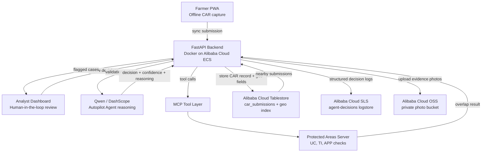

# TerraPilot Architecture

## Deployment Status

TerraPilot is 100% code-ready for Alibaba Cloud deployment. Alibaba Cloud identity verification was submitted on **08/06/2026**, and the ECS instance will be provisioned as soon as verification completes. Until then, all Alibaba Cloud integrations run through local mocks that mirror production request and response shapes.

## System Diagram



## Components

### Farmer PWA

The PWA captures producer ID, property area, vegetation type, GPS coordinates, notes, and evidence photos. It is designed for offline-first rural field conditions and syncs submissions when connectivity is available.

### FastAPI Backend on ECS

The backend exposes `/health` and `/api/validate`. In production, it runs in a Docker container on Alibaba Cloud ECS. The deployment proof is represented by [`../Dockerfile`](../Dockerfile), [`../deploy/ecs-deploy.sh`](../deploy/ecs-deploy.sh), and [`../alicloud/deployment.py`](../alicloud/deployment.py).

### Qwen / DashScope

Qwen is the reasoning engine for the Autopilot Agent. It evaluates CAR submissions, produces confidence scores, explains decisions, and determines when a human analyst should review a case.

### MCP Tool Layer

The Model Context Protocol layer gives the agent access to deterministic environmental tools. The protected areas MCP server checks whether submitted coordinates overlap with conservation units, indigenous territories, or permanent preservation areas.

### Analyst Dashboard

The dashboard is the human-in-the-loop surface. Analysts inspect agent reasoning, protected-area checks, submission details, and evidence photos before approving or rejecting flagged cases.

## Data Flow

1. The farmer captures CAR data and photos in the PWA.
2. The PWA syncs the submission to the FastAPI backend.
3. FastAPI sends the normalized submission to Qwen through DashScope.
4. Qwen decides whether more evidence is needed and asks for MCP checks.
5. The MCP protected areas server evaluates the submitted coordinates.
6. FastAPI persists the submission and geospatial fields in Tablestore.
7. FastAPI writes structured decision logs to SLS for auditability.
8. FastAPI uploads photos to OSS and stores returned object URLs with the submission.
9. Low-risk cases are approved automatically; flagged cases appear in the analyst dashboard.

## Alibaba Cloud Integrations

### ECS

ECS hosts the Dockerized FastAPI backend. The deployment script is idempotent: it updates the system, installs Docker when needed, clones or refreshes the repository, preserves existing `.env` credentials, rebuilds the container, installs Logtail, and waits for `/health`.

### Tablestore

Tablestore stores CAR submissions as persistent agent memory. Each record includes producer ID, submission timestamp, area, vegetation type, decision, confidence score, reasoning, and GPS-derived geospatial fields. A search index can support radius queries for conflict detection.

### Simple Log Service

SLS receives structured logs for every Qwen decision and MCP tool call. Logs include submission ID, farmer ID, confidence score, decision status, reasoning, tools invoked, processing latency, model name, region, and timestamp.

### OSS

OSS stores farmer evidence photos and documents. Object keys use a deterministic layout: `photos/{farmer_id}/{timestamp}_{filename}`. Production buckets should use private ACLs and signed URLs for analyst access.

### Qwen / DashScope

DashScope provides access to Qwen models such as `qwen-max`. The local proof keeps mock responses production-shaped until Alibaba Cloud account verification unlocks provisioned credentials.

## Architecture Decisions

- **Docker on ECS:** simple, reviewer-friendly deployment proof with a direct path to production.
- **Tablestore for CAR memory:** key-value access plus search indexes fit submission history and geospatial lookups.
- **SLS for audit:** environmental decisions require structured, immutable, queryable logs.
- **OSS for photos:** binary evidence belongs in object storage, not the primary submission table.
- **MCP for tools:** separates deterministic environmental checks from probabilistic Qwen reasoning.
- **Local mocks:** account verification should not block reviewers from running the integration proof locally.

## Verification

Run the deployment proof locally:

```bash
python alicloud/deployment.py
```

Build the ECS container:

```bash
docker build -t terrapilot-test .
```

Run ECS bootstrap on an Alibaba Cloud Ubuntu instance:

```bash
sudo bash deploy/ecs-deploy.sh
```
